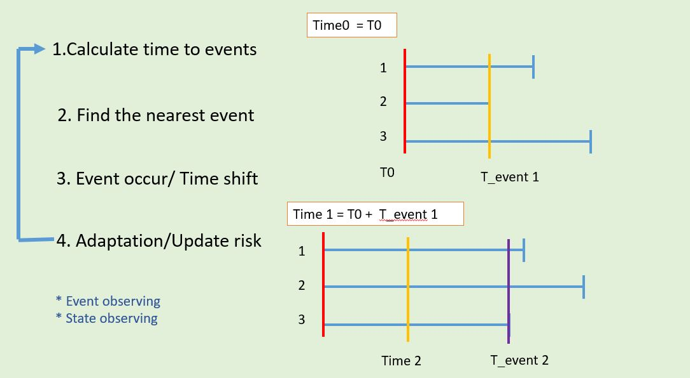
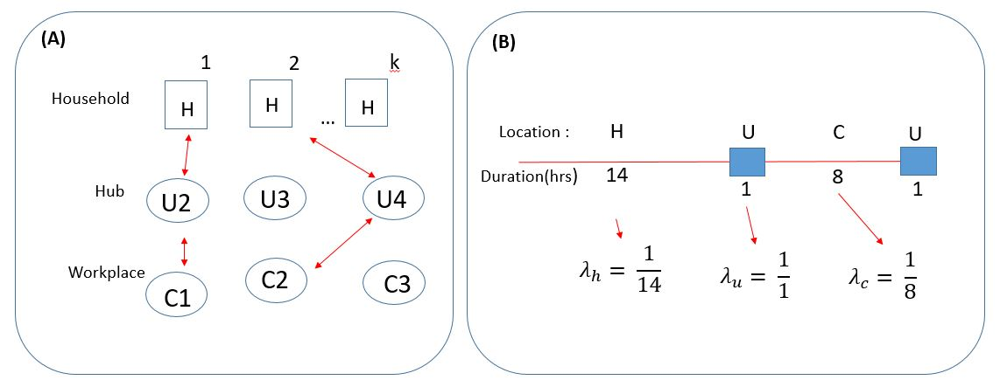
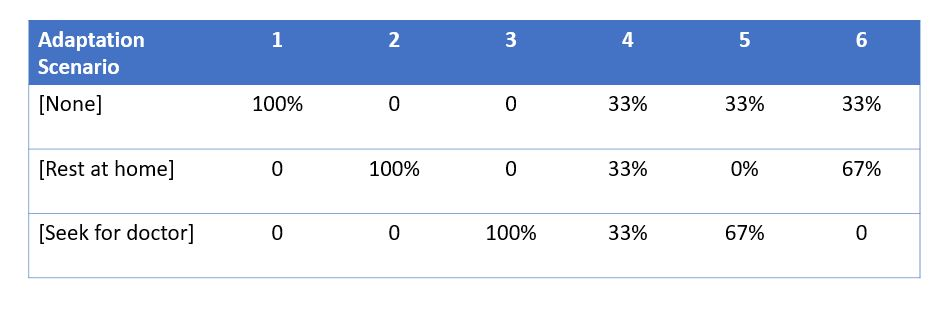
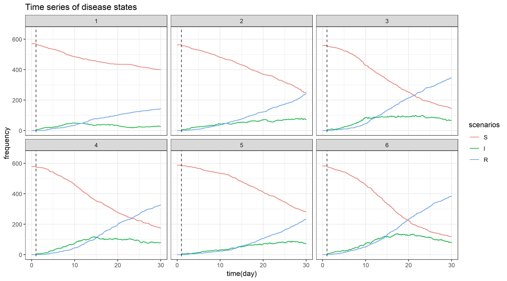
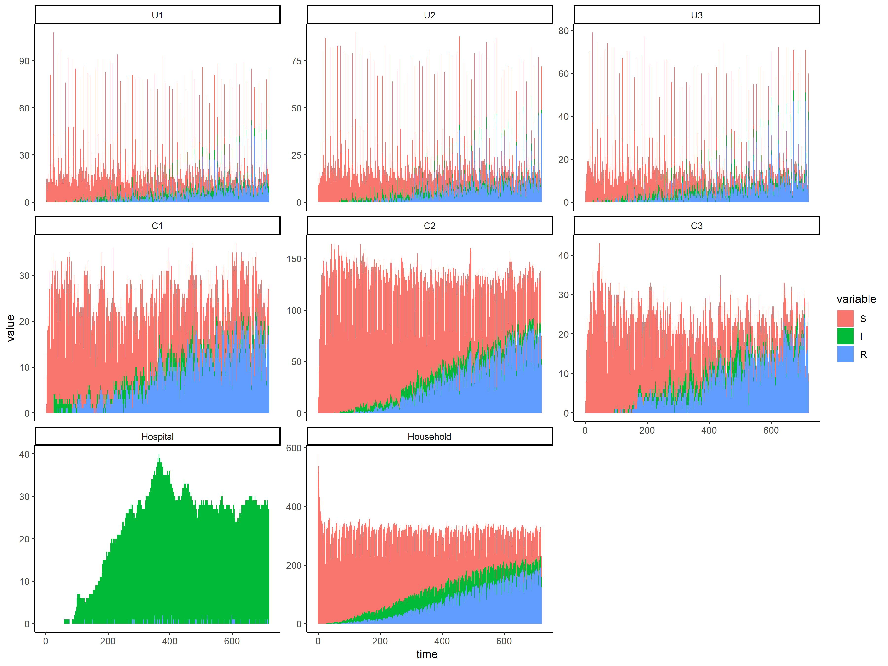
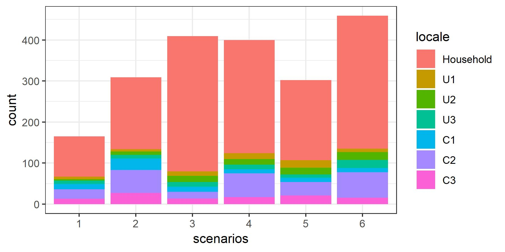
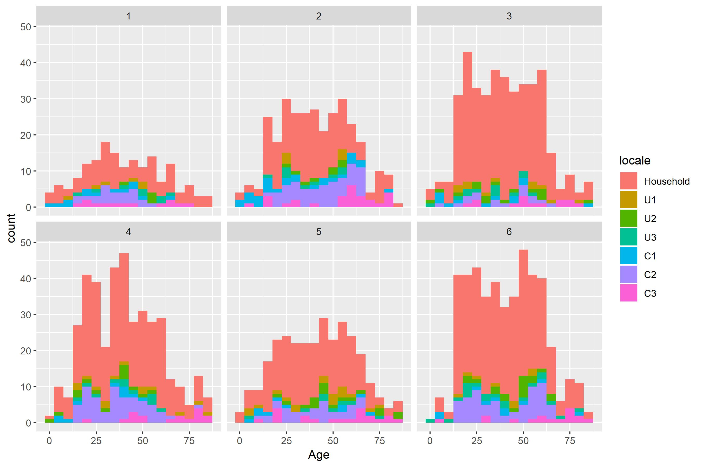

## Introduction {#TOP}
  While Equation-based compartmental models were frequently used to investigate the transmission dynamics of infectious diseases (e.g. measles, rubella, smallpox, etc.), it is difficult to apply such method to disease with complicated natural history or population heterogeneity. This project applied an agent-based transsmission model with classic susceptible-infectious-recovery process, and household-hub-workplace mobility structurein order to model outbreaks under heterogeneous settings. The designing process and report of our model follows the ODD protocol for standard and transparent communication of agent-based models (Grimm et al.,2006, Grimm et al.,2010) The souce code for this model can be found in https://github.com/dachuwu/ABM_house_hub_work.

## The protocol
1. [Purpose](#S1)
2. [Entities, States and Scales](#S2)
3. [Process and Scheduling](#S3)
4. [Design Concept](#S4)
5. [Initialization](#S5)
6. [Input Data](#S6)
7. [Submodels](#S7)

## The experiment
8. [Implementation](#S8)
9. [Results](#S8)


***

## 1. Purpose {#S1}
  The purpose is to investigate how daily commuting behavior, adaptation behavior due to infection, and age-assortative contact affects the risk and consequence of an outbreak. 

## 2. Entities, States and Scales {#S2}
  The agents/individuals in this model are human hosts who can be characterized by several state variables: identity number, infection status, location, household, age, mobility, and sanitation level. The description of these variables are listed below.
  
Variable        | Range/ categories            | Description |
--------------- | -----------------------------| ---------------------------------- |
Individual identity | 1 ~ population size  |Integer |
Infection status| Susceptible(S), Infectious(I), Recovered(R) |Categorical; the susceptible individuals are healthy people able to be infected by the infectious individuals. Recovered individuals are immune and cannot be infected. |
Location        | School/Company(1:3), hubs(1~3), Household(1~200) | Categorical; for people who commute, they move between the different locations or stay the same location in time step (ever hour). Within the School/Company, the contact pattern between individuals and different from the one in households.|
Household identity| 1 ~ no. of households |Integer|
Age             | 1~85 |Integer; contributes to the contact rate with other individuals, the mortality, and the mobility. |

  
## 3. Process and Scheduling {#S3}
  We assume a hypothetical town with 3 transportation hubs(U), 3 worplaces and 200 households. The model proceeds in  continuous  time steps, and in transition, agents can  either (1) move to othe loaction, or (2) infect other contact. Individuals can only contact with other individual at the same location at every time point. Individuals also commute in a regular manner: household->Hub->workplace or the reverse.
  The schedule is shown below,
  
<center>
[Figure 1. Scheduling]

</center>


## 4. Design Concept {#S4}


* __Emergence__ : Population-level disease transmission dynamics emerge from the behavior of individuals. Individual behaviors such as age-specific contact pattern, commute habit and the natural history are modeled explicitly in this model.
* __Sensing__ : We assume individuals are in the know about their own age, disease progression, and sanitation level so that they will follow the age-specific or adaptive behavior.
* __Adaptation__ : Agents only go to one age-specific location, e.g., child going to school at each time step. 
* __Interaction__ : One interaction is modeled explicitly, that the transmission between infectious individuals and susceptible individuals.
* __Stochasticity__ : All the epidemiological, demographic, and behavioral parameters will be set as probability distributions.
* __Observation__ : The infection status will be recorded in each time step at a population level and subgroup-level (e.g. different location, age strata, etc.)|


## 5. Initialization {#S5}
* Determine total number of households  
* Sample household size (1-6) on the basis of Taiwan census 
* Assign individual id, household id
* Sample individuals age on the basis of Taiwan census
* Sample fixed moving pathway
* All individual stay at home in initial time, with disease sate = S


## 6. Input Data {#S6}
The distribution of population age structure, household size are adopted from Department of Statistics, Ministry of the Interior, Taiwan.

## 7. Submodels {#S7}

### 7.1 Disease progression
We applied the classic susceptible-infectious-recovery (SIR) process in a continuous-time manner to the disease progression submodel (Figure 2). At each transition timepoint, we evaluate the time-to-event for each individual based on their current state. For susceptible individuals, we sample the time-to-infection according to the force-of-infection $\beta I$ in his/her location. For infectious individualswe sample the time-to-recovery according to the parameter of recovery rate $\gamma$. Once the individual is infected and recovered, he/she will stayed in the recovery state permanently. We used Poisson waiting time (exponential) distribution for the time-to-event for its memoryless feature.

* Time-to-infection for susceptible individuals

$$ f(\text{time-to-infection}) = \lambda e^{-\lambda t}  $$

* Time-to-recovery for infectious individuals

$$ f(\text{time-to-infection}) = \gamma e^{-\gamma t}  $$
<center>
[Figure 2. SIR process]

</center>

### 7.2 Movements
We assume each individual has fixed commuting pathways everyday. Suppose there are $n_h$ households, 3 hubs and 3 workplaces in this hypothetical community, there will be 9 different commuting pathways. Figure 3A illustrate two example commuting pathways: H1-U2-C1-U2-H1, and H1-U3-C2-U3-H2. We also used Poisson waiting time (exponential) distribution for the time-to-movement between locations. As shown in figure 3B, we assume an individua spends, on average 14 hours at home, 8 hours working, and 1 hour for commuting both for going work and home.
<center>
[Figure 3. Commuting process]

</center>


## 8. Implementation: a demo example {#S8}

In the section, I will demonstrate how to use the R program provided in https://github.com/dachuwu/ABM_house_hub_work to simulate an outbreak in the household-hub-workplace setting. You may use the program to run your simulation, tune the parameters at interest, and evaluated potential interventions on your own.

i. First, we need to load the required packages and the programs. While the simulator was mainly written by R basic functions, some plotting functions will require __reshape2__ and __ggplot2__ to carry out.
```{r message=FALSE, warning=FALSE}
require(reshape2)
require(ggplot2)
source('./ABM_Base_func.R')
source('./ABM_Simulator.R')
```

ii. The `RunABM()` function is the wrapper simulator, that requires two arguments: `setting` (a named vector to specify all the parameters and initial conditions) and `outName` (specify the name of the outout object in .RData fromat). In this demo example, we applie the following setting:
    + `Par.Gamma` the average recovery rate of infected individuals (the inverse of infectious duration in hours)
    + `Par.Beta` the average contact rate of an individual (no. of contact per hour)
    + `Par.iprob` the probability of success infection given a contact between a pair of infectious and susceptible individual
    + `Par.rel.vuln` the relative risk for vulnerable population (children and elder people)
    + `H.total` the total number of households to be simulated
    + `dlen` the total time of simulation (in days)
    + `T.df` the temporal resolution in which the simulated outbreak will be recorded
    + `int.after` the day to begin introducing seed infectious individuals
    + `int.site` the initial site for introducing seed infectious individuals
    + `int.num` the number of seed infectious individuals
    + `p.rest` the probability for a new infected individual to rest at home (stop commuting, but still contact with family members)
    + `p.seek` the probability for a new infected individual to seek doctor (stop commuting and contact with susceptibe individuals)

```{r message=FALSE, warning=FALSE, paged.print=FALSE, eval=FALSE}
### Not RUN
Result<-RunABM(Settings = c(Par.Gamma = (1/6)/24,
                            Par.Beta = 10/24,
                            Par.iprob = .05,
                            Par.rel.vuln = 1.5,
                            H.total = 300,
                            dlen = 30,
                            T.df = 1,
                            int.after = 0,
                            int.site = 5,
                            int.num = 10,
                            p.rest = 2/3,
                            p.seek = 1/3), outName = "tmp")

### Not RUN
load("demo_result.RDat")
get.info(Result)
```

iii. The simulated result will be saved in .RData format. We can use `get.info()` to retrieve the parameter setings of the result 
```{r message=FALSE, warning=FALSE}
load("demo_result.RDat")
get.info(Result)
```

iv. `GenPlotDat()` function helps to convert the simulated result to severl forms of data.frame for plotting. Below are two simple examples.

Time series plot of the overall outbreak
```{r}
Gdf <- GenPlotDat(Result,set.var = 1)
T.ts.df <- Gdf[[1]]
tsplot1 <- ggplot(T.ts.df)+theme_bw() +
  geom_path(aes(x = V1/24,y = count, group = state, color = state))+
  labs(x = "time(day)", y = "frequency", title = "Time series of disease states")+
  geom_vline(aes(xintercept = 1), lty=2, alpha=.8)
tsplot1
```


Time series in stacked bars for the individual composition in total household, hubs(U1-3), workplaces(C1-3) and hospital 
```{r}
locpattern<-ggplot(Gdf[[2]])+
  geom_bar(aes(x = time,y = value, fill = variable),
           stat="identity", position="stack", width = 1)+
  facet_wrap(~LOC, nrow = 3, ncol = 3, scales = "free_y")+
  theme_classic()
locpattern
```

v. You can explore the structure of the simulated object `Result` and create you own visualization at your viewpoint. 


## 9. Results {#S9}
In this analysis, we aimed at assessing the imapct of the adaptive behaviors on the consequence of the outbreak. Particularly, we compared 9 adaptive scenarios by varying the probability of (1) none adaptation, (2) staying at home, and (3) seek doctors and staying at hospital. The parrameter settings are shown in figure 4.  
<center>
[Figure 4. Parameters dettings for nine adaptation scenarios]

</center>

### 9.1 Outbreak evolution over time
<center>
[Figure 5]

</center>

### 9.2 Individual distribution over time and location (scenario 4)
<center>
[Figure 6]

</center>

### 9.3 Total case distribution by infected location and scenario
<center>
[Figure 7]
 
</center>

### 9.4 Age distribution of infected cases by scenario
<center>
[Figure 8]

</center>

## References
1. Grimm, V., Berger, U., Bastiansen, F., Eliassen, S., Ginot, V., Giske, J., ... & Huth, A. (2006). A standard protocol for describing individual-based and agent-based models. Ecological modelling, 198(1-2), 115-126.

2. Grimm, V., Berger, U., DeAngelis, D. L., Polhill, J. G., Giske, J., & Railsback, S. F. (2010). The ODD protocol: a review and first update. Ecological modelling, 221(23), 2760-2768.


[back to top](#TOP)